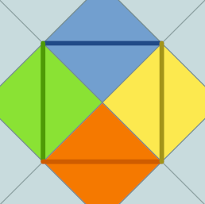
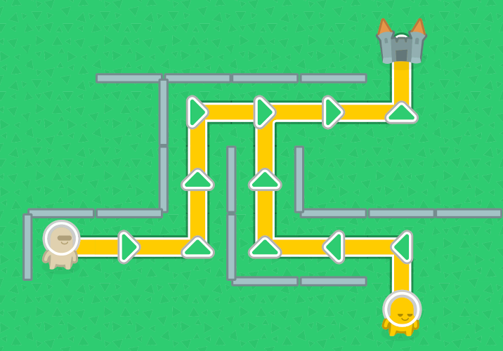

= edgemaze III.
:toc:
:note-caption: :information_source:
:warning-caption: :warning:

Vaším úkolem za 5 bodů je vytvořit pomocí PyQt5 grafické uživatelské rozhraní, které
umožní vizualizovat a editovat bludiště. Můžete samozřejmě vyjít z práce na cvičení,
ale zbývá toho poměrně dost dodělat. Rozhraní umožní:

* vytvářet nové bludiště zadaných rozměrů (prázdné, náhodně generované apod., jak chcete)
** generování náhodného bludiště však musí trvat snesitelně dlouho, v případě nutnosti si vypomožte Cythonem
* ukládat a načítat bludiště ve formě NumPy matic do/ze souborů dle volby uživatele
** pokud se to nepovede, musí aplikace zobrazit chybové hlášení v grafické podobě (tj. ne jen do konzole)
** formát souborů viz níže
* prohlížet bludiště v grafické podobě
** včetně všech objektů v něm a vizualizace nejkratší cesty mezi postavami a cílem (viz níže)
** pokud se bludiště celé nevejde do okna, musí mít posuvníky (jako na cvičení)
** zoom (např. *Ctrl* + kolečko myši) není nutný, ale je příjemný
* klást do bludiště objekty (zdi, cíle, postavy) a odebírat je (tyto změny se projeví v paměti na úrovni NumPy matice)
** princip kladení zdi je znázorněn na obrázku níže (kliknutí do oblasti vytvoří nebo odstraní příslušnou zeď)
* nabídka *Help* > *About* vyvolá okno s informacemi o aplikaci:
** název
** stručný popis
** autor/autoři (vy, případně i my, pokud používáte náš kód)
** odkaz na repozitář
** informace o licenci
** pokud používáte public domain grafiku z https://opengameart.org[OpenGameArt.org], nemáte právní povinnost zdroj zmínit, ale považujeme to za slušnost

Veškerou potřebnou grafiku najdete ve složce `graphics` tohoto repozitáře.

== Objekty a jejich reprezentace v matici

* jako cíl použijte obrázek hradu (nejnižší bit čísla)
* zdi se zobrazují na hraně daného pole (vlevo a nahoře, dle druhého a třetího nejnižšího bitu čísla), není potřeba řešit, která zeď překrývá kterou
* postavy jsou průchozí a je jich 5 různých druhů, pro jejich kódování použijte čtvrtý až šestý nejnižší bit čísla reprezentující pole (ve třech bitech kódujte čísla 1 - 5, 0 v těchto bitech znamená pole bez postavy, například číslo 22 reprezentuje 2. typ postavy na políčku se zdí vlevo a nahoře, číslo 41 je pole s postavou 5. typu na cíli a beze zdí)

== Zobrazování cesty

* nejkratší cesty od všech postav k cíli zobrazte pomocí obrázků čar ze složky `graphics`
* výpočet cesty pro jednu postavu máte připraven z minulých úkolů
* aplikaci nebudeme testovat na bludiště tisíce krát tisíce jako minulý úkol, ale pro rozumné velikosti (cca do 200 na 200) výpočet musí proběhnout dostatečně svižně, aby aplikace byla použitelná
* musíte si zvolit vhodný způsob, jak více cest od více postav složit do jedné tak, abyste mohli použít křižovatky apod.
** tip: názvy souborů s čarami nejsou náhodné
** tip: jelikož cesta vede přes políčka, na kterých může být postava nebo cíl, nemůžete cestu ukládat do matice s bludištěm
* výpočet nových cest musíte provést po každé změně bludiště (vytvoření, načtení, přidání/odebrání objektu)
** kód spojující cesty by měl proto být relativně rychlý (v případě nutnosti si vypomožte Cythonem, ale při vhodně zvoleném algoritmu to není nutné)
* na cestě musí být znázorněny šipky směrem k cíli
** matici šipek máte opět z úloh z minula, stačí je zobrazit pouze tam, kde jsou čáry
* od některých postav logicky cesta k cíli nemusí existovat, od nich tedy žádnou nevykreslujte (aplikace s takovou situací musí počítat a nesmí spadnout)

== Formát souboru s bludištěm

Ukládejte a načítejte bludiště takto, umožní nám to jednodušší kontrolu:

[source,python]
----
numpy.savetxt(path, array)
array = numpy.loadtxt(path, dtype=numpy.int8)
----

== Předchozí (stále platné) zadání

Je vyžadováno zrychlení algoritmu řešení bludiště pomocí Cythonu tak,
aby zvládal řešit i bludiště o rozměrech v řádech nižší jednotky tisíců × nižší jednotky tisíců
na moderním počítači (srovnatelném s těmi ve školní učebně) v průměrném čase maximálně 1 sekundu
(a volání `.path()` by se u takového bludiště mělo stihnout za sekundu aspoň 50).
Úkol musí splňovat všechny náležitosti z minula + podmínku na čas.

WARNING: Vaším úkolem *není* přepsat celé řešení do Cythonu.

Vaším úkolem je pomocí NumPy vytvořit funkci `analyze(array)` v modulu `edgemaze`.

NOTE: Referenční řešení algoritmu je zde v repozitáři ve složce `edgemaze`.

Na vstupu bude dvourozměrné bludiště uložené v matici,
bludiště obsahuje zdi na rozhraních mezi políčky matice a volitelné množství cílů umístěných v políčkách matice.

Malá celá čísla v matici kódují situaci podobně jako práva souborů v Unixu:

- nejnižší bit kóduje cíl: čísla obsahující 1 označují cíle,
- druhý bit kóduje stěnu na rozhraní vlevo: čísla obsahující 2 označují zeď na rozhraní vlevo,
- třetí bit kóduje stěnu na rozhraní nahoře: čísla obsahující 4 označují zeď na rozhraní nahoře.

Příklady:

- 0 znamená: toto není cíl, vlevo ani nad tímto políčkem není zeď,
- 4 znamená: toto není cíl, vlevo od tohoto políčka není zeď, ale nad ním ano,
- 7 znamená: toto je cíl, vlevo i nad tímto políčkem je zeď.

Ostatní bity ignorujte, tedy i pokud jsou nastaveny, jedná se o validní vstup.

V bludišti se lze pohybovat pouze horizontálně nebo vertikálně.
Zdi nelze procházet. Hranice matice jsou neprůchozí.

Funkce `analyze(array)` vrátí objekt, který má:

atribut `distances`::
  NumPy matice vhodného celočíselného typu, kde pro každé políčko, ze kterého se dá dostat do cíle,
  bude délka nejkratší cesty k cíli, jinak -1.

atribut `directions`::
  NumPy matice typu `('a', 1)`, kde je pro každé takové políčko směr, kterým se odtud dá nejrychleji dostat do cíle,
  jako ASCII byte `^`, `v`, `<` nebo `>`; pro nedostupná políčka mezeru a pro cíle `X`.
  V případě více rovnocenných (stejně dlouhých) cest do cíle vyberte libovolnou,
  ale stejnou jako v metodě `path()` (níže).

atribut `is_reachable`::
  `True` pokud se dá z každého políčka dostat do cíle, jinak `False`.

metodu `path(row, column)`::
  Vrátí souřadnice nejkratší cesty z políčka `(row, column)` jako seznam dvojic včetně cíle a startu;
  pro cesty z cíle do cíle obsahuje jen jednu souřadnici (cíl tedy není uveden dvakrát);
  pro souřadnice nedostupných políček vyhodí výjimku.
  V případě více rovnocenných (stejně dlouhých) cest do cíle vyberte libovolnou,
  ale stejnou jako v atributu `directions`.

V případě, že vstup není správného typu, selže funkce s patřičnou výjimkou;
pro více informací prostudujte přiložené testy.

== Automatické testy

Součástí zadání minulých úkolů je sada automatických testů.
Jejich splnění je povinnou, nikoli však dostačující podmínkou pro splnění úkolu.

Pro spuštění testů nainstalujte do virtuálního prostředí balík `pytest-timeout` a spusťte:

[source,console]
$ python setup.py build_ext -i  # sestaví modul napsaný v Cythonu
$ python -m pytest -v tests

Testy nevyžadují žádný speciální setup, funkce `analyze` nemá žádné side-effecty.
Testy si doporučujeme zkopírovat k sobě do repozitáře.

WARNING: Test `test_large_maze_fast` je doplněn o kontrolu na čas pomocí pluginu `pytest-timeout`.
Pokud máte slabší počítač, můžete testovat se sníženou hodnotou `BIG_ENOUGH_NUMBER`.

NOTE: Úloha na PyQt nové testy nemá.

== Licence

Zadání této úlohy, testy i případné referenční řešení jsou zveřejněny pod licencí
https://creativecommons.org/publicdomain/zero/1.0/deed.cs[CC0].

WARNING: Při použití PyQt5 ale musíte použít licenci GNU GPL,
což licence CC0 bez problémů umožňuje.
Pokud se tomuto problému chcet vynout, můžete použít místo PyQt5 knihovnu PySide2.

== Odevzdávání úkolu

* pokud ještě nemáte, vytvořte si nový privátní git repozitář s názvem `edgemaze` (do něj nás pozvěte, případné kolize s existujícími repozitáři řešte e-mailem)
* pokud již máte, pokračujte ve stejném repozitáři
* tato úloha je ze sady úloh, všechny se budou tématicky věnovat bludišti
* v repozitáři odevzdávejte pomocí tagu `v0.3`

Uvítáme, pokud přidáte další testy k nově implementované logice, ale není to nutné.

Aplikace musí jít spustit ve venvu (na systému, pro který jsou PyQt5 wheels na PyPI,
a na kterém je nainstalovaný překladač C a hlavičkové soubory Pythonu) takto:

[source,console]
----
$ python -m pip install -r requirements.txt
$ python -m pip install -e.
$ python -m edgemaze
----

Doporučujeme si sekvenci těchto příkazů vyzkoušet v novém venvu, ať nedochází ke zbytečným chybám.

Aplikace nesmí při žádné akci uživatele zhavarovat (tím nemyslíme, když uživatel udělá z terminálu **Ctrl** + **C**,
ale když např. klikne někam, kde jste to nečekali, nebo zruší dialog pro výběr jména souboru). Pokud se vám
zdá v zadání něco nelogické, prosím, zeptejte se.
